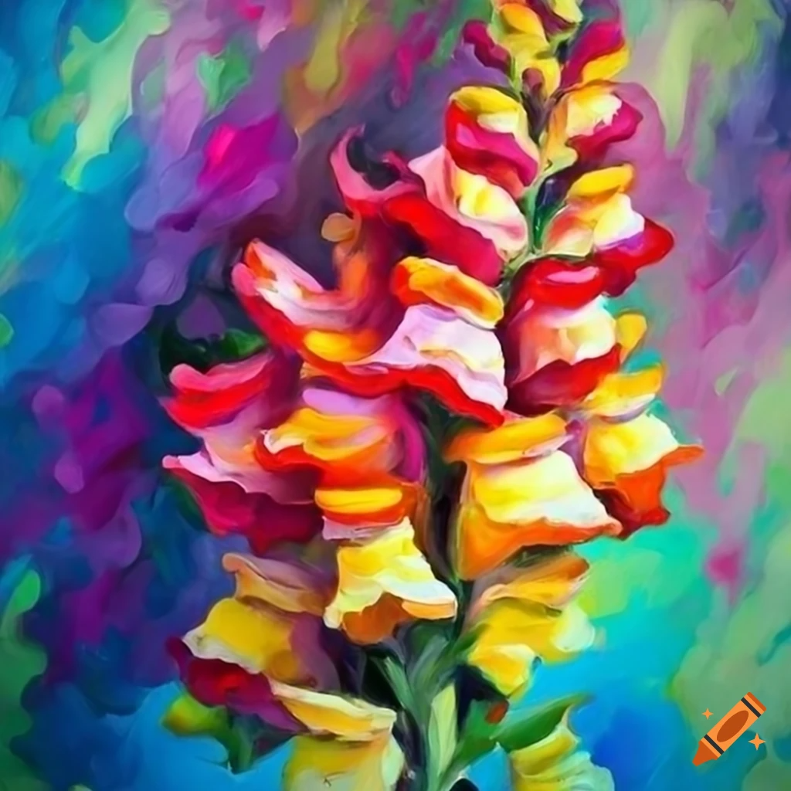

## SnapPalette Usage Documentation

### Overview
**SnapPalette** is a python script designed for the analysis of color variations in snapdragon flowers (*Antirrhinum*). It quantifies different color metrics and saves the results in a CSV format for further analysis. It would likely be useful for analysing the colour of other organisms. 

### Requirements
- Python 3.x
- OpenCV library
- NumPy library
- matplotlib library (optional for additional plotting features)

### Installation
Ensure Python is installed on your system along with the necessary libraries. You can install the required libraries using pip:

    pip install opencv-python numpy matplotlib

### Script Execution
To ensure accurate results, execute the SnapPalette script in the directory containing the target images. Results are automatically saved in the same directory as a CSV file.

#### Steps:
1. Place all images in a single directory.
2. Navigate to this directory in your command line interface (CLI).
3. Run the script using the command below.

#### Basic Command
The minimum information needed to run the program is to call python, refrence the script, and enter the name of the photo. .png and .jpg formats have been tested and work fine.

    python SnapPalette.py filename.jpg 

### Flags and Options
- `-d`, `--diameter`: Specifies a multiplier for the default circle diameter used in image analysis. This flag is optional. If omitted, the script uses a default multiplier of `1.0` (default size).
- `-c`, `--circles`: Specifies the number of circles to be placed. This flag is optional. If omitted, the script uses a default number of circles which is 6. A number less than 6 can be specified.
- `-m`, `--manual`: Manual mode allows the user to manually draw any number circles of varying sizes by mouse dragging. Flags -d and -c have no function in manual mode. 
#### Examples
- To run the script with the default circle size:

      python SnapPalette.py filename.jpg

- To run the script with half the default circle size and only 3 circles instead of 6:

      python SnapPalette.py -d 0.5 -c 3 filename.jpg 

- To double the circle size used in the analysis:

      python SnapPalette.py -d 2.0 filename.jpg

- manually add any number of circles :

      python SnapPalette.py -m 2.0 filename.jpg

### Collecting data
- Add circles to the image by left mouse clicking (default) and draging (manual mode).
- When adding more than 1 circle, the goal is to usually add these in roughly the same place, representing homologous parts of the image. Sometimes its not possibel to add a circle, because the flower is damaged. If this is the case, right clicking skips that cricle, and records 'NA' in the ouptut file.
- if you are not happy with the placement of the last circle, you can delete this with the escape key and re-place it. 
- Press enter once confirm the palcemnt of the cicles, and then a second time to record the data

### Output
- **CSV File**: data are output to a CSV file named `color_analysis_results.csv` in the same directory. This file includes comprehensive details such as the image name, circle identifier, average hue, standard deviation of hue, average saturation, standard deviation of saturation, and average brightness and standard deviation of brightness for each analyzed circle. Additional columns provide the percentage of different colors detected within each circle, based on predefined color ranges.

### Processing the output:
- the program outputs the results for each processed circle on a new line of the csv file. If multiple circles are analysed for each photo, it may be more desireable to have all the data one one line, with headers specifying the charateristic and circle analysed. This can be done using the script aggregate.py. This will also strip out percentage signs from the data. The `-i` and `-o` flags specifcy the input and output files. The default input will be color_analysis_results.csv, as this is name of the file generates by SnapPalette.

      python aggregate.py -i color_analysis_results.csv -o out.csv

### Additional Information
- **Color Ranges**: Color ranges used for analysis are predefined within the script and include common colors observed in snapdragon flowers such as red, yellow, magenta, pink, white, and orange based on the HSV projection. These values can be edited in the script and addiaitonal colours can be added if needed

